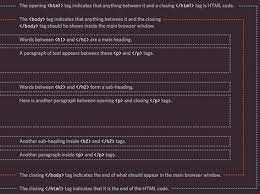

# html

#  Structure 

* ### how HTML describes the structure of a web page

HTML describes the structure of a web page semantically and originally included cues for the appearance of the document. HTML elements are the building blocks of HTML pages. With HTML constructs, images and other objects such as interactive forms may be embedded into the rendered page.

### Tags 

* The opening tag: This consists of the name of the element (in this case, p), wrapped in opening and closing angle brackets. This states where the element begins or starts to take effect — in this case where the paragraph begins.
* The closing tag: This is the same as the opening tag, except that it includes a forward slash before the element name. This states where the element ends — in this case where the paragraph ends. Failing to add a closing tag is one of the standard beginner errors and can lead to strange results.
* The content: This is the content of the element, which in this case, is just text.
* The element: The opening tag, the closing tag, and the content together comprise the element.

### *Anatomy of an HTML document*

 

* <!DOCTYPE html> — doctype. It is a required preamble. In the mists of time, when HTML was young (around 1991/92), doctypes were meant to act as links to a set of rules that the HTML page had to follow to be considered good HTML, which could mean automatic error checking and other useful things. However these days, they don't do much and are basically just needed to make sure your document behaves correctly. That's all you need to know for now.
* html html — the html element. This element wraps all the content on the entire page and is sometimes known as the root element.
* head head — the head element. This element acts as a container for all the stuff you want to include on the HTML page that isn't the content you are showing to your page's viewers. This includes things like keywords and a page description that you want to appear in search results, CSS to style our content, character set declarations, and more.
* meta charset="utf-8" — This element sets the character set your document should use to UTF-8 which includes most characters from the vast majority of written languages. Essentially, it can now handle any textual content you might put on it. There is no reason not to set this and it can help avoid some problems later on.
* titletitle — the title element. This sets the title of your page, which is the title that appears in the browser tab the page is loaded in. It is also used to describe the page when you bookmark/favorite it.
* body body — the body element. This contains all the content that you want to show to web users when they visit your page, whether that's text, images, videos, games, playable audio tracks, or whatever else.

## HTML Uses Elements to Describe the Structure of Pages

#### Description 

[read more about here](https://developer.mozilla.org/en-US/docs/Learn/HTML/Introduction_to_HTML/Document_and_website_structure) 

# Extra Markup

*  DOCTYPES tell browsers which version of HTML you
are using.

* XX You can add comments to your code between the
<(!-- and -->) markers.
*  The id and class attributes allow you to identify
particular elements.
* The <(div> and <(span> elements allow you to group
block-level and inline elements together.
* <(iframes> cut windows into your web pages through
which other pages can be displayed.
* The <(meta> tag allows you to supply all kinds of
information about your web page.
* Escape characters are used to include special
characters in your pages such as <,>, and ©.

# HTML5 Layout
* The new HTML5 elements i XX ndicate the purpose of
different parts of a web page and help to describe
its structure.
* The new elements provide clearer code (compared
with using multiple <(div> elements.
* Older browsers that do not understand HTML5
elements need to be told which elements are
block-level elements.
* To make HTML5 elements work in Internet Explorer 8
(and older versions of IE), extra JavaScript is needed,
which is available free from Google.

# Process & Design

* It's important to understand w XX ho your target audience
is, why they would come to your site, what information
they want to find and when they are likely to return.
* Site maps allow you to plan the structure of a site.
* Wireframes allow you to organize the information that
will need to go on each page.
* Design is about communication. Visual hierarchy helps
visitors understand what you are trying to tell them.
* You can differentiate between pieces of information
using size, color, and style.
* You can use grouping and similarity to help simplify
the information you present.

## *You can read more  just goole it*

 # The ABC of Programming

 * It is best to keep JavaScript code in its own JavaScript
file. JavaScript files are text files (like HTML pages and
CSS style sheets), but they have the . j s extension.

* The HTML <(script> element is used in HTML pages
to tell the browser to load the JavaScript file (rather like
the <(link> element can be used to load a CSS file).

* If you view the source code of the page in the browser,
the JavaScript will not have changed the HTML,
because the script works with the model of the web
page that the browser has created.

## *You can read more  just goole it*

