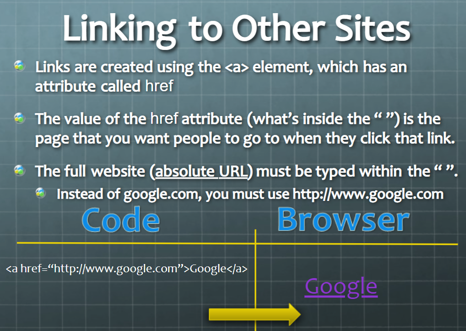
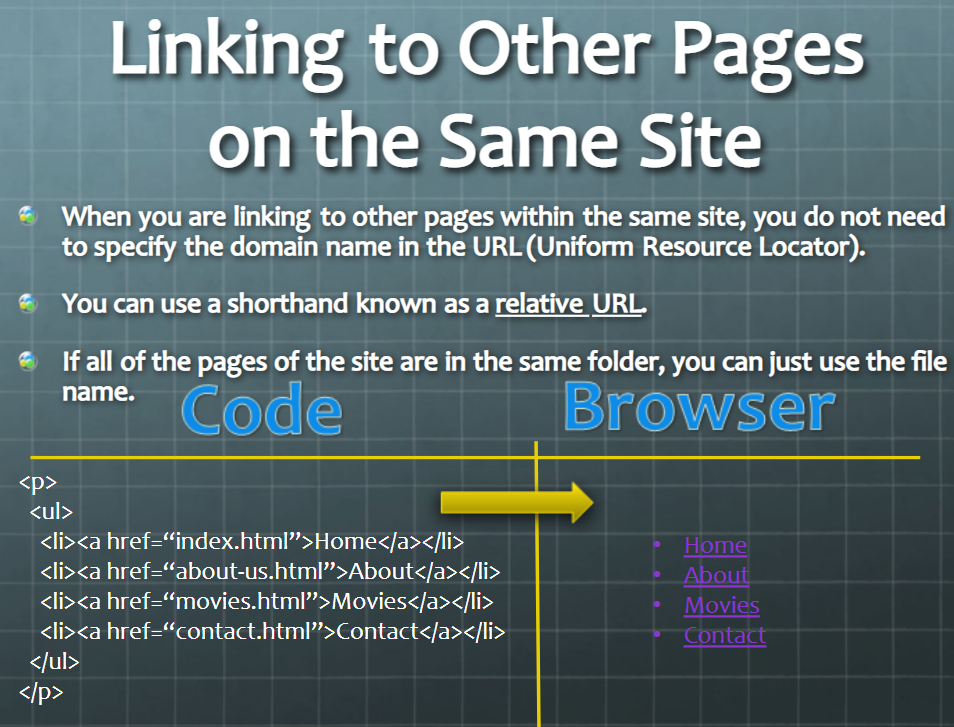
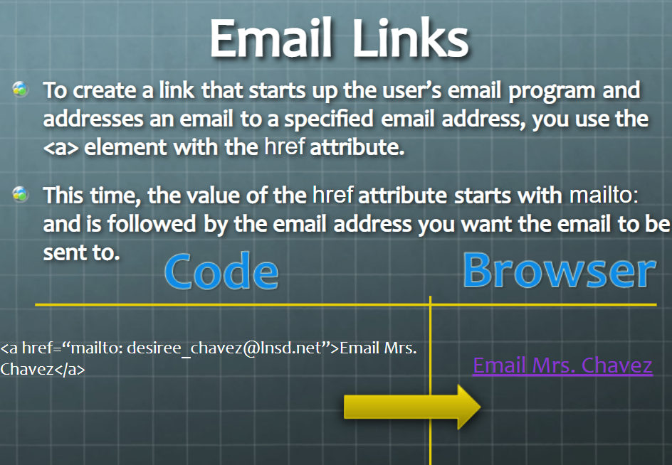
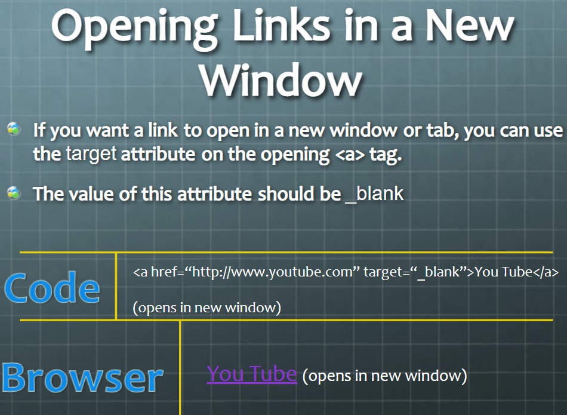
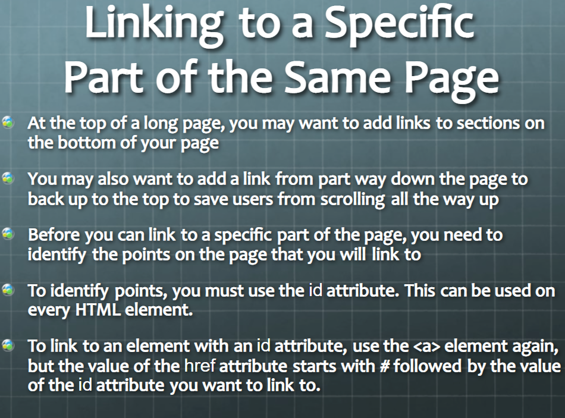
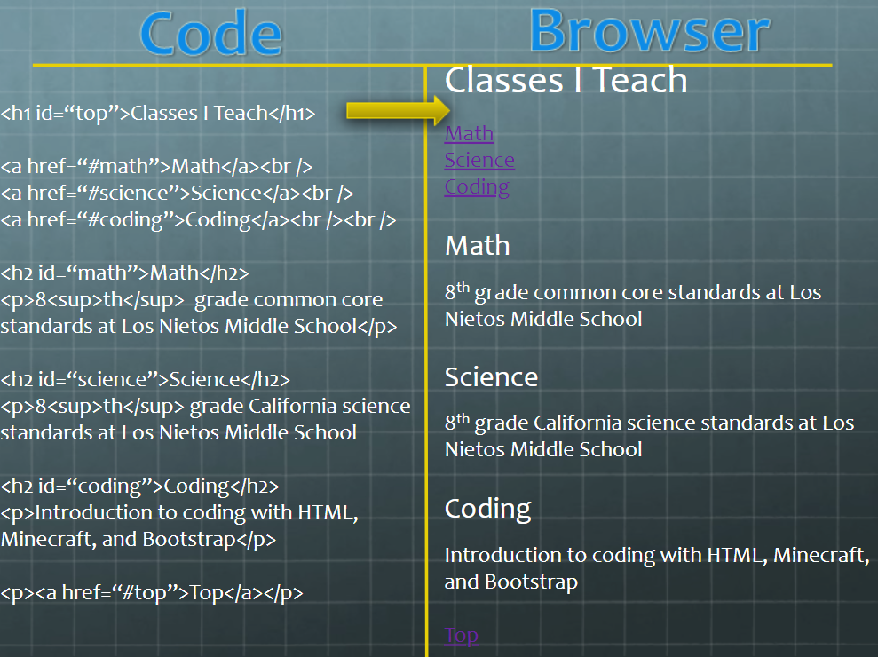

# Link 
With HTML, easily add page links to an HTML page. Link contact us, about, home or any other external website page using the page links, which gets added inside an HTML document. To make page links in an HTML page, use the `<a>` and `</a>` tags, which are the tags used to define the links.

The `<a>` tag indicates where the link starts and the `</a>` tag indicates where it ends. Whatever text gets added inside these tags, will work as a link. Add the URL for the link in the `<a href=” ”>`. Just keep in mind that you should use the `<a>`…`</a>` tags inside <`body>…`<`/body`> tags.

* Linking to Other Sites

- Linking to Other Pages
on the Same Site

* Email Links

- Op ening Links in
a New Window

* Linking to a Specific
Part of the Same Page 

- Linking to a Specific
Part of Another Page 

## Directory Structure
Organizing Files and Folder Structure for Web Pages
It is a good idea to organize your code by placing the pages for each different section of the site into a new folder. Folders are referred to as directories on websites.

## Structure
The top-level is known as the root folder. (In this example is know as the root folder called examples-site.) The root folder is contains all the other files and folders for a website.

## Relationships
The relationship between files and folders on a website is described using the same terminology as a family tree.
The example-site folder is a parent of the activities, music and theater folders.
The  activities, music and theater folders are children of the example-site folder.

## Homepages
The main homages of a site written in HTML is called index.html ( and the homepage of each section in a child folder).
Web servers are usually set up to return to the index.html file if no file name is specified.

### *Example* 

## Relative URLs
Relative URLs can be used when linking to pages within your own
website. They provide a shorthand way of telling the browser where to
find your files.

## Links Summary 
* Links are created using the `<a>` element.
- The `<a>` element uses the href attribute to indicate
the page you are linking to.
* If you are linking to a page within your own site, it is
best to use relative links rather than qualified URLs.
- You can create links to open email programs with an
email address in the "to" field.
* You can use the id attribute to target elements within
a page that can be linked to.

# Layout

### HTML Layout Elements
HTML has several semantic elements that define the different parts of a web page:

- `<header>` - Defines a header for a document or a section
- `<nav>` - Defines a set of navigation links
- `<section>` - Defines a section in a document
- `<article>` - Defines an independent, self-contained content
- `<aside>` - Defines content aside from the content (like a sidebar)
- `<footer>` - Defines a footer for a document or a section
- `
` - Defines additional details that the user can open and close on demand
- `
` - Defines a heading for the `
` element

### HTML Layout Techniques
There are four different techniques to create multicolumn layouts. Each technique has its pros and cons:

* CSS framework
* CSS float property
* CSS flexbox
* CSS grid

### CSS Frameworks
If you want to create your layout fast, you can use a CSS framework, like W3.CSS or Bootstrap.

### CSS Float Layout
It is common to do entire web layouts using the CSS float property. Float is easy to learn - you just need to remember how the float and clear properties work. Disadvantages: Floating elements are tied to the document flow, which may harm the flexibility.

### CSS Flexbox Layout
Use of flexbox ensures that elements behave predictably when the page layout must accommodate different screen sizes and different display devices.

### CSS Grid Layout
The CSS Grid Layout Module offers a grid-based layout system, with rows and columns, making it easier to design web pages without having to use floats and positioning.

## Layout Summary 
- `
` elements are often used as containing elements
to group together sections of a page.
* Browsers display pages in normal flow unless you
specify relative, absolute, or fixed positioning.
- The float property moves content to the left or right
of the page and can be used to create multi-column
layouts. (Floated items require a defined width.)
* Pages can be fixed width or liquid (stretchy) layouts.
- Designers keep pages within 960-1000 pixels wide,
and indicate what the site is about within the top 600
pixels (to demonstrate its relevance without scrolling).
* Grids help create professional and flexible designs.
- CSS Frameworks provide rules for common tasks.
* You can include multiple CSS files in one page.

# Functions, Methods, and Objects

## Functions in JavaScript
A function is a set of statements that take inputs, do some specific computation, and produces output. Basically, a function is a set of statements that performs some tasks or does some computation and then return the result to the user.

The idea is to put some commonly or repeatedly done tasks together and make a function so that instead of writing the same code again and again for different inputs, we can call that function.

Like other programming languages, JavaScript also supports the use of functions. You must already have seen some commonly used functions in JavaScript like alert(), this is a built-in function in JavaScript. But JavaScript allows us to create user-defined functions also.

We can create functions in JavaScript using the keyword function. The basic syntax to create a function in JavaScript is shown below.

### *Syntax:*

function functionName(Parameter1, Parameter2, ..)

{'

    // Function body

}

## Objects in Javascript

Objects, in JavaScript, is it’s most important data-type and forms the building blocks for modern JavaScript. These objects are quite different from JavaScript’s primitive data-types(Number, String, Boolean, null, undefined and symbol) in the sense that while these primitive data-types all store a single value each (depending on their types).

Objects are more complex and each object may contain any combination of these primitive data-types as well as reference data-types.
An object, is a reference data type. Variables that are assigned a reference value are given a reference or a pointer to that value. That reference or pointer points to the location in memory where the object is stored. The variables don’t actually store the value.
Loosely speaking, objects in JavaScript may be defined as an unordered collection of related data, of primitive or reference types, in the form of “key: value” pairs. These keys can be variables or functions and are called properties and methods, respectively, in the context of an object.

## Methods in JavaScript
JavaScript methods are actions that can be performed on objects. A JavaScript method is a property containing a function definition. Methods are functions stored as object properties.

# 6 Reasons for Pair Programming

## What is Pair Programming?
As the name implies, pair programming is where two developers work using only one machine. Each one has a keyboard and a mouse. One programmer acts as the driver who codes while the other will serve as the observer who will check the code being written, proofread and spell check it, while also figuring out where to go next. These roles can be switched at any time: the driver will then become the observer and vice versa.

It’s also commonly called “pairing,” “programming in pairs,” and “paired programming.”

[You can read more about pair programming](https://www.codefellows.org/blog/6-reasons-for-pair-programming/)

