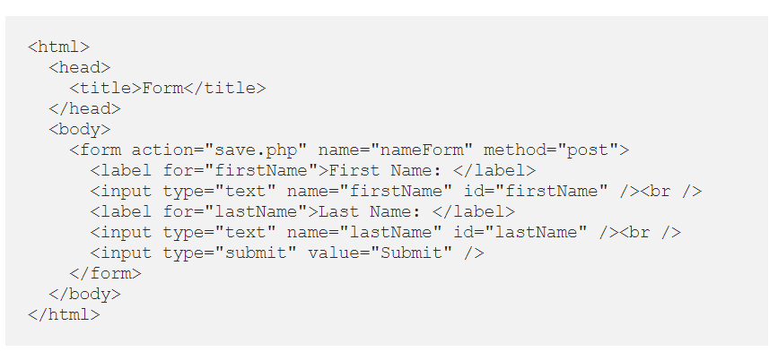

# Java Script 

## *What is Java Script*

 JavaScript is a text-based programming language used both on the client-side and server-side that allows you to make web pages interactive. Where HTML and CSS are languages that give structure and style to web pages, JavaScript gives web pages interactive elements that engage a user. Common examples of JavaScript that you might use every day include the search box on Amazon, a news recap video embedded on The New York Times, or refreshing your Twitter feed.  

Incorporating JavaScript improves the user experience of the web page by converting it from a static page into an interactive one. To recap, JavaScript adds behavior to web pages. 

## What is JavaScript used for

JavaScript is mainly used for web-based applications and web browsers. But JavaScript is also used beyond the Web in software, servers and embedded hardware controls. Here are some basic things JavaScript is used for:

 

1.     Adding interactive behavior to web pages
JavaScript allows users to interact with web pages. There are almost no limits to the things you can do with JavaScript on a web page – these are just a few examples:

* Show or hide more information with the click of a button

* Change the color of a button when the mouse hovers over it

* Slide through a carousel of images on the homepage

* Zooming in or zooming out on an image

* Displaying a timer or count-down on a website

* Playing audio and video in a web page

* Displaying animations

* Using a drop-down hamburger menu

 

2.     Creating web and mobile apps
Developers can use various JavaScript frameworks for developing and building web and mobile apps. JavaScript frameworks are collections of JavaScript code libraries that provide developers with pre-written code to use for routine programming features and tasks—literally a framework to build websites or web applications around. 

Popular JavaScript front-end frameworks include React, React Native, Angular, and Vue. Many companies use Node.js, a JavaScript runtime environment built on Google Chrome’s JavaScript V8 engine. A few famous examples include Paypal, LinkedIn, Netflix, and Uber!

 

3.     Building web servers and developing server applications
Beyond websites and apps, developers can also use JavaScript to build simple web servers and develop the back-end infrastructure using Node.js. 

 

4.     Game development
Of course, you can also use JavaScript to create browser games. These are a great way for beginning developers to practice their JavaScript skills. 

## Input Output in plain JavaScript

For many web apps, inputs and outputs are important parts of the app. Many parts of most applications consist of forms. JavaScript makes it easy to add forms and handle inputs and then get the outputs. An HTML form consists of many parts. It can have text inputs, text areas, checkboxes, radio buttons, drop downs, buttons, etc. The look of them can be adjusted with CSS, and JavaScript lets you add dynamic functionality to the form.
The form element is the HTML element that contains the controls for forms. It holds all the text inputs, radio buttons, checkboxes, text areas, etc., along with the label text for each element. It can also contains HTML elements that divide the form into sections like div , article , and section elements.

### Example of Input Output in plain JavaScript

#### Input

#### Output

# JavaScript Variables

Variable means anything that can vary. JavaScript includes variables which hold the data value and it can be changed anytime. JavaScript uses reserved keyword var to declare a variable. A variable must have a unique name.

**Examplt of JavaScript Variables** 

* [Read more about JavaScript](https://developer.mozilla.org/en-US/docs/Web/JavaScript)
* [Read more about Input Output in plain JavaScript](https://developer.mozilla.org/en-US/docs/Web/JavaScript)
* [Read more about JavaScript Variables](https://www.w3schools.com/js/js_variables.asp)