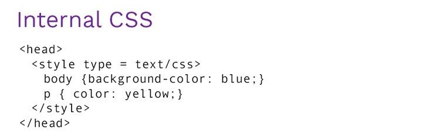
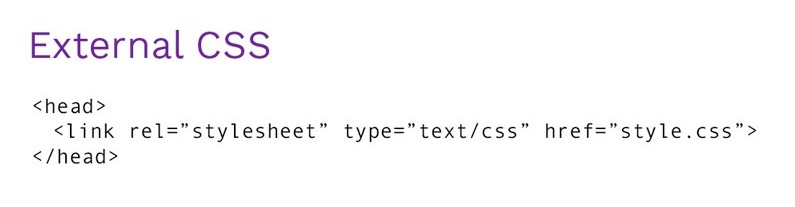
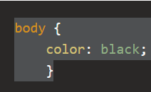
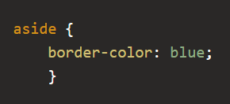
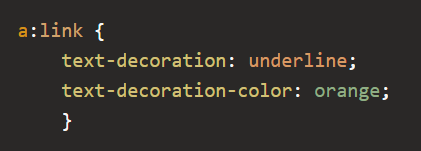

# CSS

  ## What is the CSS

  Cascading Style Sheets, fondly referred to as CSS, is a simple design language intended to simplify the process of making web pages presentable.

CSS handles the look and feel part of a web page. Using CSS, you can control the color of the text, the style of fonts, the spacing between paragraphs, how columns are sized and laid out, what background images or colors are used, layout designs,variations in display for different devices and screen sizes as well as a variety of other effects.

CSS is easy to learn and understand but it provides powerful control over the presentation of an HTML document. Most commonly, CSS is combined with the markup languages HTML or XHTML.

* CSS stands for Cascading Style Sheets
* CSS describes how HTML elements are to be displayed on screen, paper, or in other media
* CSS saves a lot of work. It can control the layout of multiple web pages all at once
* External stylesheets are stored in CSS files

## Advantages of CSS

1. CSS saves time − You can write CSS once and then reuse same sheet in multiple HTML pages. You can define a style for each HTML element and apply it to as many Web pages as you want.

2. Pages load faster − If you are using CSS, you do not need to write HTML tag attributes every time. Just write one CSS rule of a tag and apply it to all the occurrences of that tag. So less code means faster download times.

2. Easy maintenance − To make a global change, simply change the style, and all elements in all the web pages will be updated automatically.

3. Superior styles to HTML − CSS has a much wider array of attributes than HTML, so you can give a far better look to your HTML page in comparison to HTML attributes.

4. Multiple Device Compatibility − Style sheets allow content to be optimized for more than one type of device. By using the same HTML document, different versions of a website can be presented for handheld devices such as PDAs and cell phones or for printing.

5. Global web standards − Now HTML attributes are being deprecated and it is being recommended to use CSS. So its a good idea to start using CSS in all the HTML pages to make them compatible to future browsers.

## CSS syntax

### What is CSS syntax

A CSS rule-set consists of a selector and a declaration block: The selector points to the HTML element you want to style. The declaration block contains one or more declarations separated by semicolons. Each declaration includes a CSS property name and a value, separated by a colon.

# How To Add CSS

CSS is added to HTML pages to format the document according to information in the style sheet.

There are three ways to insert CSS in HTML documents.

1. Inline CSS
2. Internal CSS
3. External CSS

### 1) Inline CSS

Inline CSS is used to apply CSS on a single line or element.

example

### 2) Internal CSS

Internal CSS is used to apply CSS on a single document or page. It can affect all the elements of the page. It is written inside the style tag within head section of html.

example 

### 3) External CSS

External CSS is used to apply CSS on multiple pages or all pages. Here, we write all the CSS code in a css file. Its extension must be .css for example style.css.

example 

# CSS color Property

The color CSS property sets the foreground color value of an element's text and text decorations, and sets the currentcolor value. currentcolor may be used as an indirect value on other properties and is the default for other color properties, such as border-color.

###  list of properties that accept a color value.

* background-color
* background
* border
* border-bottom-color
* border-color
* border-left-color
* border-right-color
* border-top-color
* box-shadow
* caret-color
* color
* column-rule
* column-rule-color
* filter
* opacity
* outline-color
* outline
* text-decoration
* text-decoration-color
* text-shadow

#### here are some examples 

1. Text Color

  The color property is used to apply foreground color (which includes text color). 

     example 
     

2. Border Color

   The border-color is a shorthand property for setting the color on all sides of an element's border. There are actually quite a few different properties for doing this (these are included in the above list).

    example

    

3. Text Decoration Color

  he text-decoration-color allows you to set the color of the text-decoration property.

     example

     
     
## CSS Color Codes 

