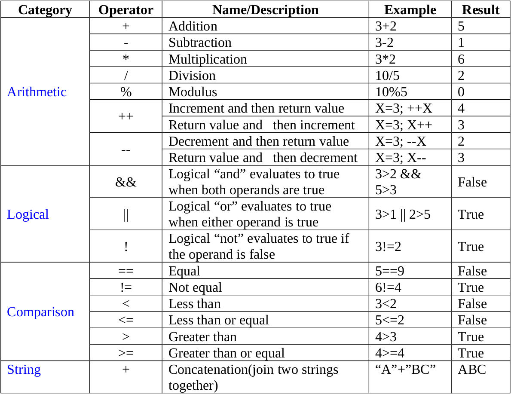

# Functions 

A function in JavaScript is similar to a procedure—a set of statements that performs a task or calculates a value, but for a procedure to qualify as a function, it should take some input and return an output where there is some obvious relationship between the input and the output.

## 1. Function declarations 
A function definition (also called a function declaration, or function statement) consists of the function keyword, followed by:

* The name of the function.
* A list of parameters to the function, enclosed in parentheses and separated by commas.
* The JavaScript statements that define the function, enclosed in curly brackets, {...}.

#### Syntax
function name([param[, param,[..., param]]])
 {

   [statements]

}

 example
 

## 2. Function expressions
The function keyword can be used to define a function inside an expression.

You can also define functions using the Function constructor and a function declaration.

allows us to create an anonymous function which doesn’t have any function name which is the main difference between Function Expression and Function Declaration. A function expression can be used as an IIFE (Immediately Invoked Function Expression)which runs as soon as it is defined. A function expression has to be stored in a variable and can be accessed using variableName.  With the ES6 features introducing Arrow Function, it becomes more easier to declare function expression.

#### Syntax for Function Expression (anonymous) :  

let variableName = function(x, y) { statements... return (z) };

#### Syntax for Function Expression (named) :  

let variableName = function functionName(x, y) { statements... return (z) };

[read more about function](https://developer.mozilla.org/en-US/docs/Web/JavaScript/Guide/Functions)

# Control flow

The control flow is the order in which the computer executes statements in a script. Code is run in order from the first line in the file to the last line, unless the computer runs across the (extremely frequent) structures that change the control flow, such as conditionals and loops.

For example, imagine a script used to validate user data from a webpage form. The script submits validated data, but if the user, say, leaves a required field empty, the script prompts them to fill it in. To do this, the script uses a conditional structure or if...else, so that different code executes depending on whether the form is complete or not:

if (field==empty) {
    promptUser();
} else {
    submitForm();
}

A typical script in JavaScript or PHP (and the like) includes many control structures, including conditionals, loops and functions. Parts of a script may also be set to execute when events occur.

[read more about control flow](https://developer.mozilla.org/en-US/docs/Glossary/Control_flow)

# JavaScript Functions
A function is a set of statements that take inputs, do some specific computation, and produces output. Basically, a function is a set of statements that performs some tasks or does some computation and then return the result to the user.

The idea is to put some commonly or repeatedly done tasks together and make a function so that instead of writing the same code again and again for different inputs, we can call that function.

Like other programming languages, JavaScript also supports the use of functions. You must already have seen some commonly used functions in JavaScript like alert(), this is a built-in function in JavaScript. But JavaScript allows us to create user-defined functions also.

### Syntax:

function functionName(Parameter1, Parameter2, ..)

{
    // Function body
}

[read more about JavaScript Function](https://www.w3schools.com/js/js_functions.asp)

# JavaScript Operators

[read more about JavaScript Operators](https://www.w3schools.com/js/js_operators.asp)

